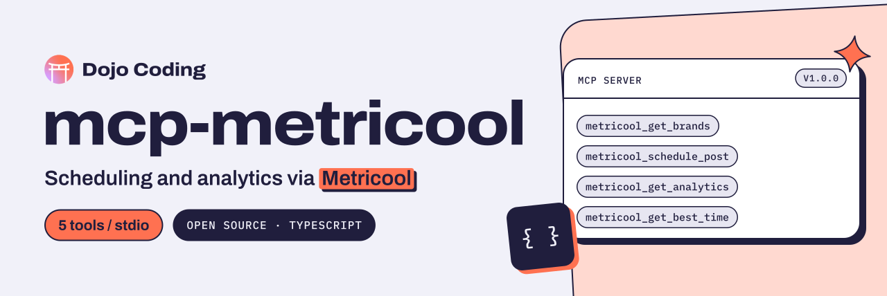

<p align="center">
  <a href="https://dojocoding.io">
    <picture>
      <source media="(prefers-color-scheme: dark)" srcset="docs/assets/banner-dark.svg">
      <source media="(prefers-color-scheme: light)" srcset="docs/assets/banner-light.svg">
      
    </picture>
  </a>
</p>

# mcp-metricool

**An MCP server for builders who want to schedule posts, check analytics and find the best posting times in Metricool from an MCP client.**

MCP server for [Metricool](https://metricool.com) — schedule social media posts, get analytics, and find optimal posting times.

[](package.json) [](https://nodejs.org)

[Get started](#setup) · [Tools](#tools) · [Environment variables](#environment-variables) · [Report an issue](https://github.com/DojoCodingLabs/mcp-metricool/issues/new)

## Tools

| Tool | Description |
|------|-------------|
| `metricool_get_brands` | List all connected brands/accounts |
| `metricool_schedule_post` | Schedule a post (LinkedIn, Instagram, Facebook, etc.) |
| `metricool_get_scheduled_posts` | View pending scheduled posts |
| `metricool_get_analytics` | Get post performance metrics |
| `metricool_get_best_time` | Find optimal posting times based on engagement |

## Setup

```bash
npm install
npm run build
```

### Environment Variables

```
METRICOOL_TOKEN=your-api-token
METRICOOL_USER_ID=your-user-id
```

Get your API token from: Metricool → Settings → API

### Usage with Claude Desktop / OpenClaw

```json
{
  "mcpServers": {
    "metricool": {
      "command": "node",
      "args": ["path/to/mcp-metricool/dist/index.js"],
      "env": {
        "METRICOOL_TOKEN": "your-token",
        "METRICOOL_USER_ID": "your-user-id"
      }
    }
  }
}
```

## Supported Networks

LinkedIn, Twitter/X, Facebook, Instagram, YouTube, TikTok, Threads, Bluesky — depends on what's connected in your Metricool account.

## License

MIT. Built by [Dojo Coding](https://dojocoding.io).

<p align="center">
  <a href="https://dojocoding.io"></a>
</p>
